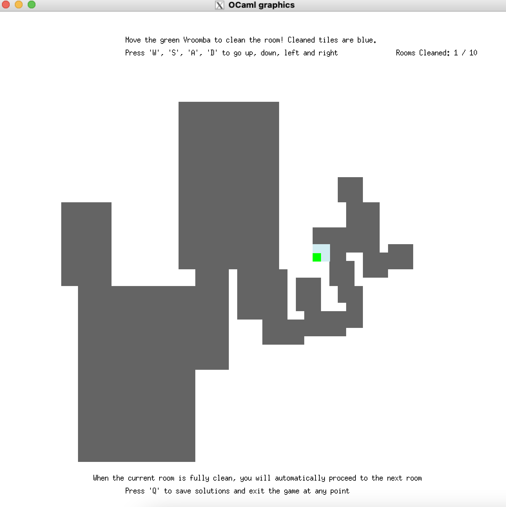

# Vroomba: The Magical Cleaning Robot

This is the final team project for the "YSC2229 Introductory Data Structures and Algorithms" course. There is an individual report where I reflect on the design choices the team has taken while programming this game. Part of this README.md file is taken from the project descriptions and instructions written by Prof. Ilya Sergey.

## Programme Overview
Vroomba is a cleaning bot that cleans the tile it sits on and the 8 adjacent tiles. It is initially placed in a room of dirty tiles and the goal of the game is to control the bot to move across a randomly generated room and clean all the tiles. My contributions to the team project are: RoomUtil.ml RoomGenerator.ml, RoomChecker, and various tests.

To play the game, go the the folder's directory in terminal. First execute ```make``` command. Then execute ```bin/vroomba play rooms.txt test.sol```
The user should use the keys `w`, `a`, `s` and `d` to control the movements of Vroomba on a screen and `q` to exit the game (in this case the results of all complete games should be saved to the file).



Additionally, the programme can perform 3 other tasks: solving a room, checking a solution, and generating a random room.
  

## Execution Modes
These are the runner modes and their corresponding additional arguments:

* ```bin/vroomba solve input_file output_file```

  In this mode, the runner takes a file with the path `input_file`
  containing a number of room encodings, each on a new line, and
  produces a file `output_file` of solutions (move strings), one per
  line.

  An example input file with 10 medium-size problems can be found in
  `resources/rooms.txt`. A result of solving it should be a file with
  10 strings of Vroomba moves (i.e., each string is something like
  `WWDDDDDSSSAAADDDWWWA` but probably longer).

  As another examples the files `basic.txt` and `basic.sol` under
  `resources` show an examples of a valid input/output with a single
  room.

* ```bin/vroomba check input_file solutions_file```

  In this mode, the runner takes a file with the path `input_file`
  with rooms and a file with the path `solutions_file` containing
  solutions and matches, line by line, that each solution in
  `solutions_file` is a valid solution to a room in `input_file` from
  the corresponding line. Empty lines at the end and at the middle of
  the files should be ignored.
  
  This mode should output to the terminal the statistics for the
  solution for the corresponding problems. For instance for a pair
  4-line room/solution files, where the solutions for rooms 1, 2, and
  4 are correct, and the one for 3 is wrong, the output should be
  as follows:

  ```
  1: 241
  2: 23
  3: Fail
  4: 12
  ```
  
  In the successful cases, the numbers (e.g., `241`) denote the length
  of the list of moves in the solution. You can use this mode to check
  your solution produced by the `solve` mode.


* ```bin/vroomba generate num size output_file```

  This mode generate `num` rooms of the size `size` (the span along
  either of the dimensions) and write them into `output_file`, one per
  line. The result file should have a similar format as
  `resources/roooms.txt`.
  

* ```bin/vroomba play input_file output_file```

  This mode reads all the rooms from the file `input_file` and starts
  a series of "games". Each game allows the user to solve the room by
  navigating Vroomba in a room, recording the user's moves in the
  background. Once a room is fully "sweeped", a next room from the
  sequence is displayed, if any. Once all games are complete, the
  resulting sequences of the moves for each room are written to the
  `output_file`. The resulting should be possible to check against
  `input_file` via the `check` mode of the runner.
 

## Project Structure

The code is split into three parts.

* `lib` is a collection of the data structures and algorithms we were
  studying in this class. 

* `runners` is a folder with a single runner file needed to start the Vroomba game.

* `vroomba` is a folder, where most of the development took
  place. 
